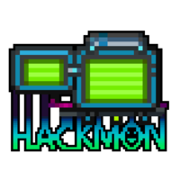
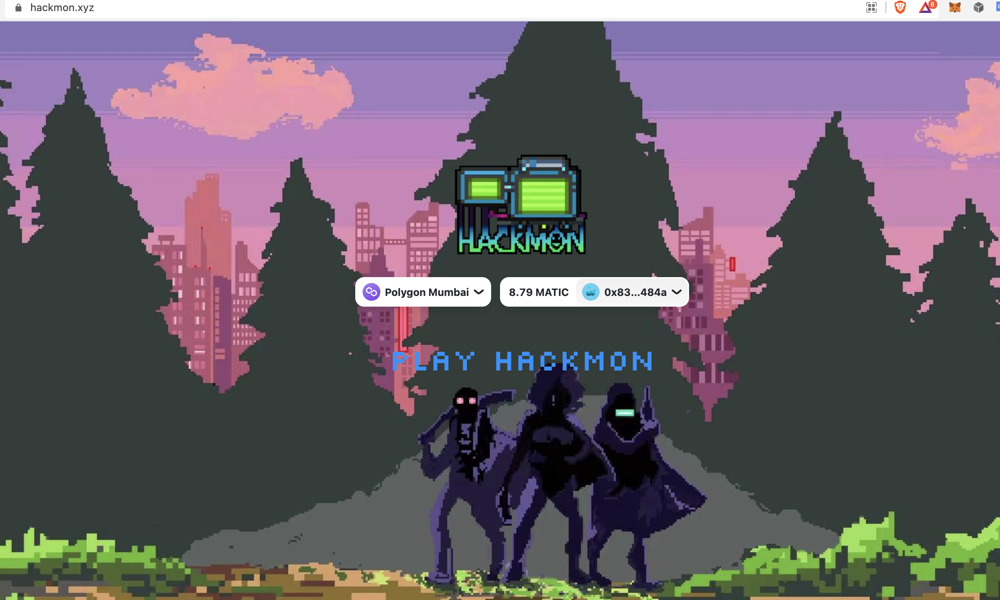
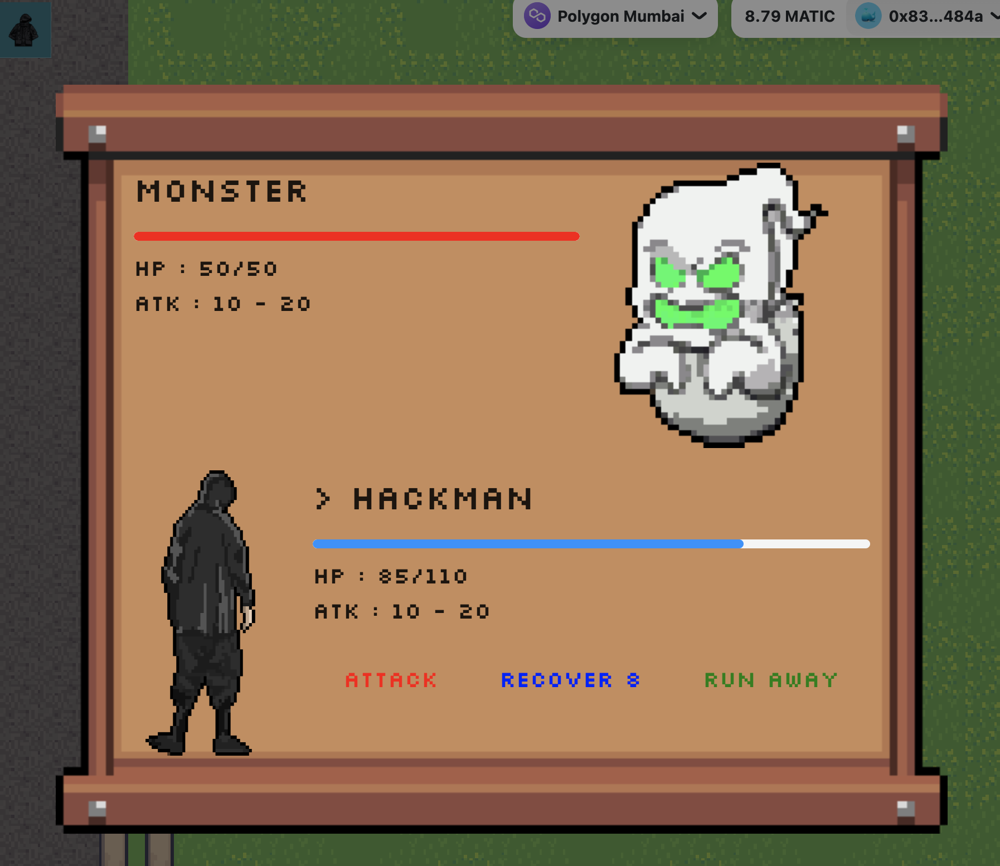
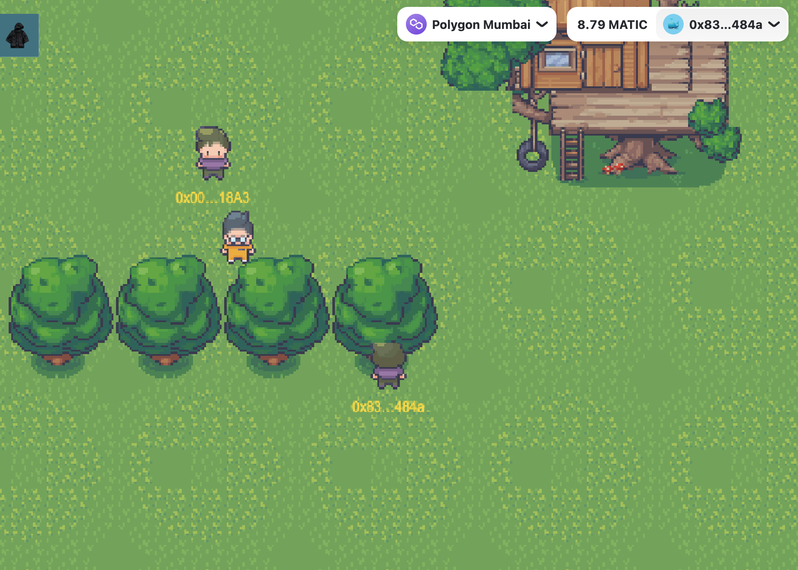
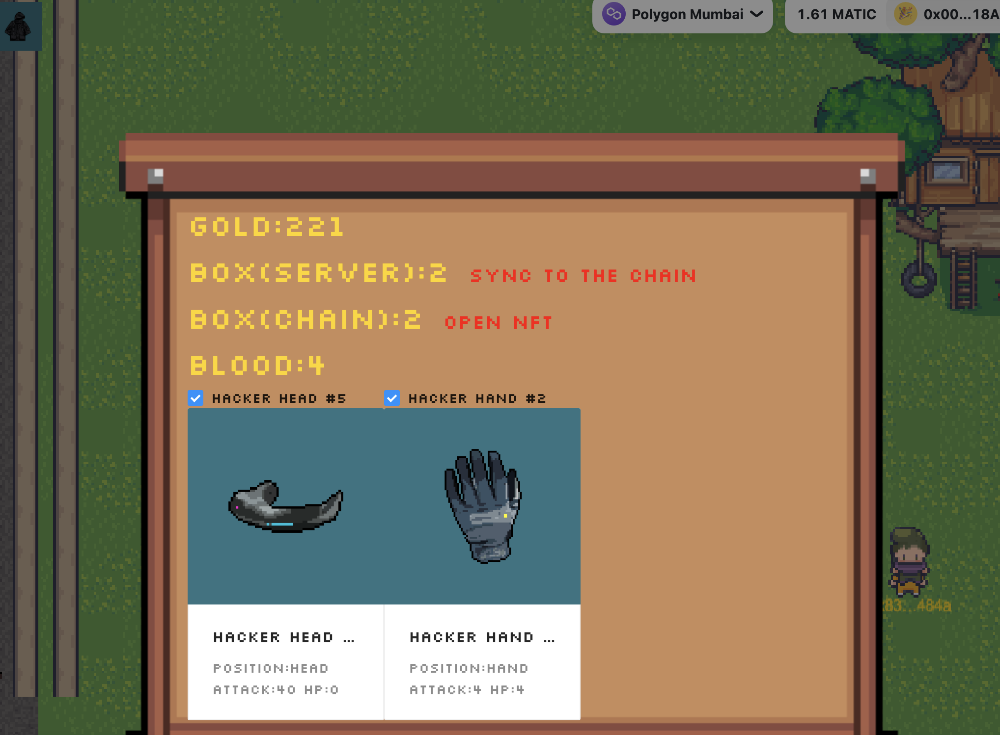

# This is  [Hackmon](https://hackmon.xyz) !

 

 

## hackmon is an MMORPG where players can socially and fight monsters, Protect Ethereum safety and dedicated to defeating monsters in the dark forest, play to own

## Inspiration

**Hackmon** it comes from Pokémon and 2077, trying to create a web3 hacker dream

## What it does

web use `nextjs`+`rainbowkit`+`colyseus`+`phaser`+`wagmi`

Large-scale multiplayer role-playing games can obtain money or enhance equipment equipment by fighting the enemy.

## How we built it

We use **Chainlink Any API** to synchronize the user's game data to the chain, and use **Chainlink VRF** to randomly obtain bonus equipment.On the other hand, it also uses **Any API + Automation** to synchronize the game data of all players, so that every player can verify it on the chain

## What's next for hackmon

 we intend to continue to do the trading market in the game. Low taxes and fast transactions may also have AMA exchanges. Players' equipment can be synthesized to generate rare props.Add more story plot.
 let more web2 users can play the game

