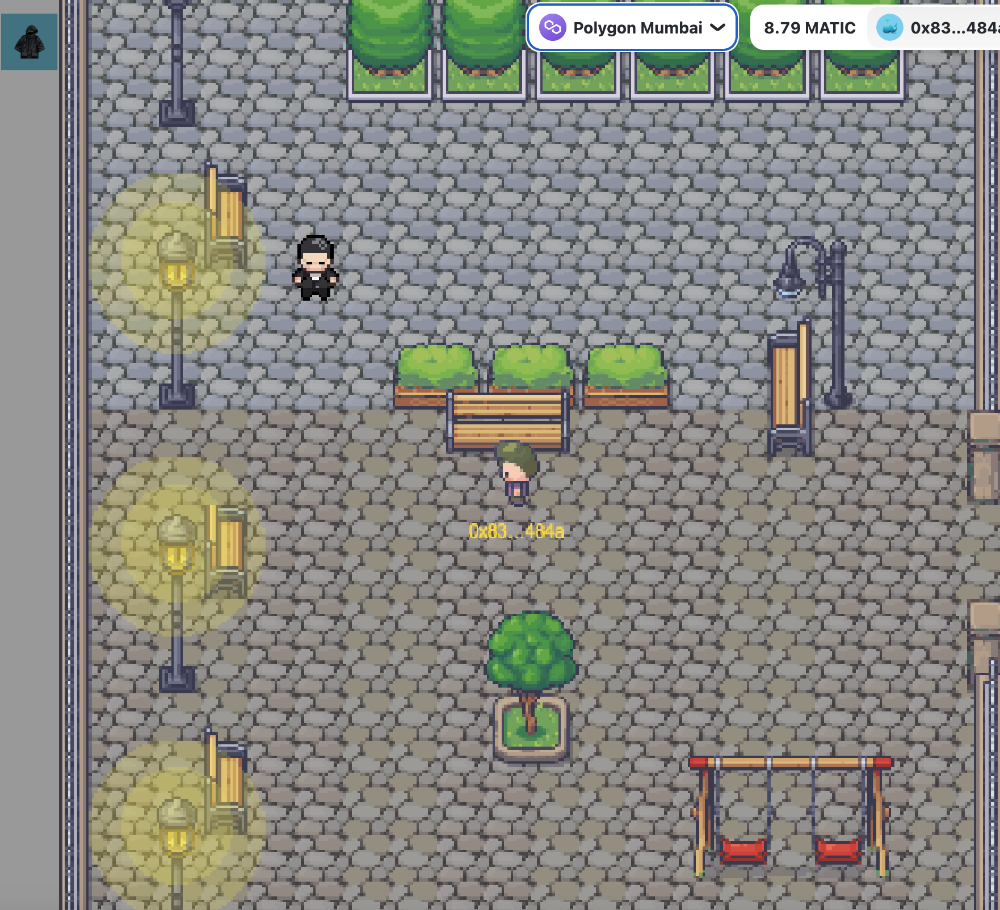
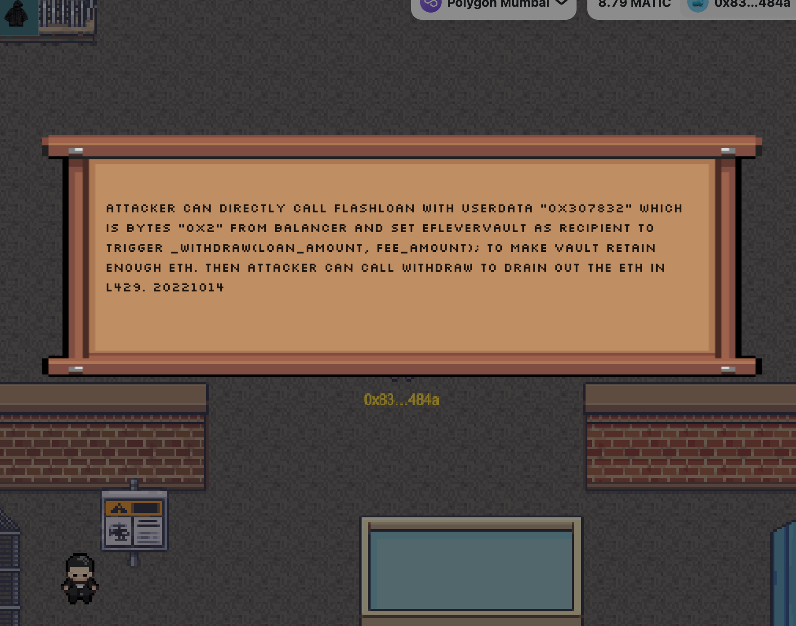

# This is  [Hackmon](https://hackmon.xyz) !

 

 

## hackmon is an MMORPG where players can socially and fight monsters, Play to own

## Inspiration

**Hackmon** it comes from Pokémon and 2077, trying to create a web3 hacker dream

## What it does

A large multi -person role -playing game can get money or strengthen the equipment of the equipment by fighting the enemy, so that more people are silent here.

## How we built it

We use Chainlink Any API to synchronize the user's under -linter data to the chain, and use Chainlink VRF to randomly obtain bonus equipment.On the other hand, it also uses Any API + Automation to synchronize the key data of all players, so that every player can verify it on the chain

## Challenges we ran into

supabase is learning while doing it. The game also adds a multiplayer system. In the future, we plan to fight against players. We wrote some contracts for the trading market, but we haven't finished it yet.

## Accomplishments that we're proud of

We finished it in a short time, and also found the chain self -inspection system composed of Any API+Automation, so that players can play with confidence, and will not have the problem of losing central data like FTX.

## What we learned

I wrote 4 warehouses. I will have hand in all the processes. The work ability is more comprehensive. For the first time, I used Supabse. It feels very good.

## What's next for hackmon

In the contract, we intend to continue to do the trading market in the game. Low taxes and fast transactions may also have AMA exchanges. Players' equipment can be synthesized to generate rare props.The game threshold, so that more web2 users can play the game

